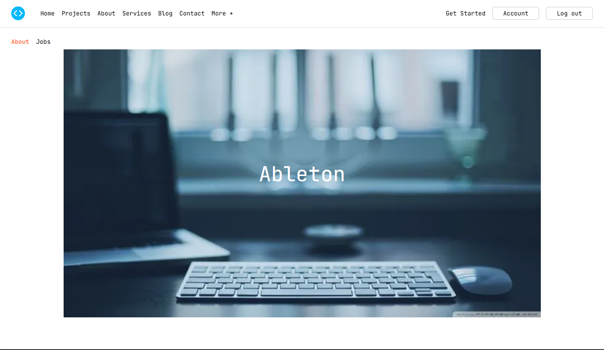

# Ableton UI — Frontend Practice

> Recreación del challenge de **Ableton** de [Frontend Practice](https://www.frontendpractice.com/) migrado a **Astro 7** (SSG) con optimización de imágenes, Tailwind CSS v4 y despliegue automático a GitHub Pages.



---

## 🚀 Demo en vivo

**<https://14bryanespinoza.github.io/ableton/>**

---

## ✨ Características

- **Astro 7** — Static Site Generation (SSG), zero-JS por defecto
- **Tailwind CSS v4** — Configuración CSS-first con `@theme` y design tokens
- **astro-icon + Lucide** — Iconos SVG optimizados (tree-shaking automático)
- **Sharp** — Optimización de imágenes en build (WebP, responsive)
- **TypeScript strict** — Tipado completo en componentes y data
- **ESLint + Prettier** — Linting y formato unificado (con plugins Astro/Tailwind)
- **Husky + lint-staged** — Pre-commit hooks que evitan commits rotos
- **GitHub Pages via Actions** — Deploy automático en push a `main`

---

## 📁 Estructura del proyecto

```text
src/
├── components/          # Componentes reutilizables (Button, Form, Link, Section)
├── data/                # Datos estructurados (collection, links, metadata)
├── layouts/             # Layouts de página (Layout, Header, Hero, Footer)
├── pages/               # Rutas (index.astro)
├── styles/              # Estilos globales + design tokens (global.css)
└── assets/              # Imágenes optimizadas por Astro (favicon, hero, panels)
public/
├── favicon.png          # Favicon servido en raíz (/favicon.png)
└── preview.png          # Imagen Open Graph / Twitter Card
```

---

## 🛠️ Comandos

```bash
# Instalar dependencias (pnpm)
pnpm install

# Desarrollo local (http://localhost:4321)
pnpm dev

# Build de producción (genera dist/)
pnpm build

# Preview del build local
pnpm preview

# Lint + formato
pnpm lint
pnpm format
```

> **Node requerido:** ≥ 22.12 (configurado en `package.json` y workflow CI)

---

## 🌐 Despliegue

El sitio se publica automáticamente en **GitHub Pages** vía Actions al hacer push a `main`:

1. **Job `build`** — `withastro/action@v6` (Node 22) → `pnpm install` + `pnpm build` → sube `dist/` como artifact
2. **Job `deploy`** — `actions/deploy-pages@v4` → publica el artifact en el entorno `github-pages`

URL final: **<https://14bryanespinoza.github.io/ableton/>**

> La base path está configurada en `astro.config.mjs`:
>
> ```js
> site: "https://14bryanespinoza.github.io/ableton/",
> base: "/ableton/",
> build: { assets: "assets" }
> ```

---

## 🧱 Componentes principales

| Componente           | Descripción                                          |
| -------------------- | ---------------------------------------------------- |
| `Layout.astro`       | Shell HTML, metadata, fuentes, favicon, slots        |
| `Header.astro`       | Navbar responsive, logo (favicon), menú mobile       |
| `Hero.astro`         | Sección hero con fondo optimizado + CTA              |
| `Section.astro`      | Contenedor genérico de sección (2-col mobile-first)  |
| `PanelSection.astro` | Panel lateral con imagen + texto + CTA               |
| `Footer.astro`       | Footer con links, copyright, redes                   |
| `Button.astro`       | Botón accesible (variant, size, asChild)             |
| `Link.astro`         | Enlace polimórfico (`as` prop) con skip link         |
| `Form.astro`         | Formulario newsletter (preparado para Astro Actions) |

---

## 📦 Datos (src/data/)

- **`metadata.ts`** — SEO, Open Graph, Twitter Card, canonical, preview image
- **`links.ts`** — Enlaces de navegación, redes, CTA
- **`collection.ts`** — Items de las secciones (panels, features) con imports de imágenes

---

## ♿ Accesibilidad

- Skip link en `Header` para navegación por teclado
- Semántica HTML5 (`header`, `main`, `section`, `footer`, `nav`)
- `alt` descriptivos en todas las imágenes
- Contraste AA/AAA en tokens de color (Tailwind)
- `prefers-reduced-motion` respetado (desactiva animaciones)
- Focus visible en enlaces y botones

---

## 🔧 Stack técnico

| Herramienta  | Versión | Uso                                     |
| ------------ | ------- | --------------------------------------- |
| Astro        | 7.x     | SSG, islas, optimización assets         |
| Tailwind CSS | 4.x     | Utility-first, design tokens            |
| TypeScript   | 5.x     | Tipado estricto                         |
| ESLint       | 9.x     | Linting (plugin-astro, plugin-tailwind) |
| Prettier     | 3.x     | Formato (plugin-astro, plugin-tailwind) |
| Husky        | 9.x     | Git hooks                               |
| lint-staged  | 17.x    | Lint/format solo en archivos staged     |
| Sharp        | 0.35.x  | Transformación imágenes en build        |

---

## 📝 Licencia

MIT — libre para uso personal y educativo.
