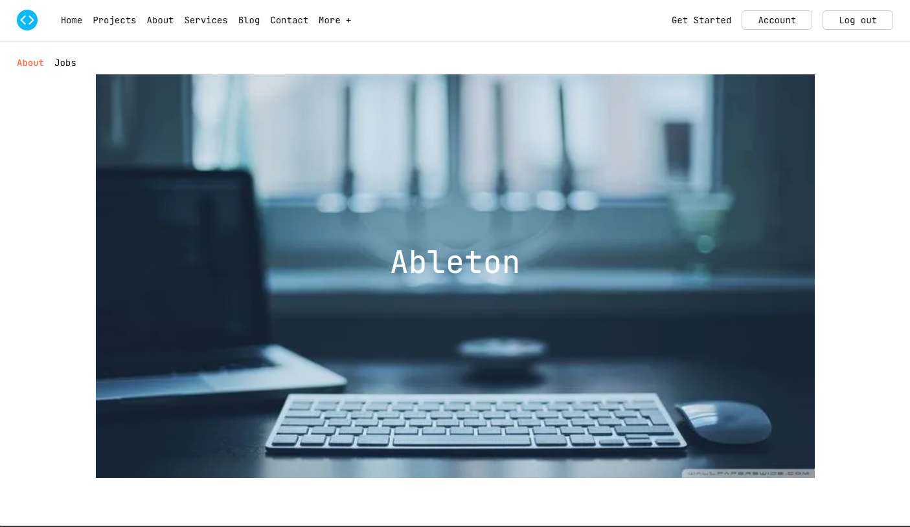

# Ableton UI — Frontend Practice

[](https://github.com/14BryanEspinoza/ableton/actions/workflows/deploy.yml)
[](https://github.com/14BryanEspinoza/ableton/actions/workflows/ci.yml)
[](LICENSE)

> Recreación del challenge **Ableton** de [Frontend Practice](https://www.frontendpractice.com/): sitio estático construido con **Astro 7** (SSG, cero JS por defecto), **Tailwind CSS v4** y despliegue automático a GitHub Pages.



---

## 🌐 Demo en vivo

**<https://14bryanespinoza.github.io/ableton/>**

---

## ✨ Qué incluye

- **Astro 7 (SSG)** — HTML estático, sin JavaScript en el cliente (0 `<script>` en el build).
- **Tailwind CSS v4** — configuración CSS-first con `@theme` y design tokens en `src/styles/global.css`.
- **Imágenes optimizadas** — `<Picture>` con `formats={["avif", "webp"]}`, `srcset`/`sizes` responsive y `layout="constrained"` vía Sharp en build.
- **astro-icon + Lucide** — iconos SVG con tree-shaking.
- **JetBrains Mono variable** — una sola petición de fuente (`wght@100..800`) con `preconnect` a Google Fonts.
- **Sitemap + robots** — `@astrojs/sitemap` genera `sitemap-index.xml`, `robots.txt` apunta a él.
- **Página 404** propia (`src/pages/404.astro`), generada en el build.
- **TypeScript** — `astro check` con `typescript@5.7` sobre los 16 archivos de `src/`.
- **ESLint 10 + Prettier** — plugins de Astro y Tailwind, con `--check` en CI.
- **Husky + lint-staged** — formateo y lint en cada commit.
- **CI + Deploy separados** — un workflow valida, otro publica.

---

## 📁 Estructura

```text
src/
├── components/          # Button, Form, Link, Section
├── data/                # collection.ts, links.ts, metadata.ts
├── layouts/             # Layout, Header, Hero, Footer
├── pages/               # index.astro, 404.astro
├── styles/              # global.css (design tokens + reset de accesibilidad)
└── assets/              # 11 imágenes procesadas por Astro en build
public/
├── favicon.png          # favicon
├── preview.png          # imagen Open Graph / Twitter Card
└── robots.txt           # con referencia al sitemap
.github/workflows/
├── ci.yml               # lint + format:check + astro check
└── deploy.yml           # build + deploy a GitHub Pages
```

---

## 🛠️ Comandos

```bash
pnpm install       # instalar dependencias

pnpm dev           # desarrollo local (http://localhost:4321)
pnpm build         # build de producción → dist/
pnpm preview       # previsualizar el build

pnpm check         # astro check (TypeScript + Astro types)
pnpm lint          # eslint .
pnpm lint:fix      # eslint . --fix
pnpm format        # prettier --write .
pnpm format:check  # prettier --check .  (lo que corre CI)
```

> **Node ≥ 22.12** (declarado en `package.json` y usado en ambos workflows).

---

## 🧱 Componentes

| Componente      | Rol                                                                    |
| --------------- | ---------------------------------------------------------------------- |
| `Layout.astro`  | Shell HTML: metadata SEO, Open Graph, fuente, favicon, skip link, slot |
| `Header.astro`  | Navbar sticky con menú mobile accesible (checkbox + `peer`, sin JS)    |
| `Hero.astro`    | Sección hero con imagen `priority` y `aria-labelledby`                 |
| `Section.astro` | Sección genérica reutilizable: título, texto y galería de imágenes     |
| `Footer.astro`  | Links, formulario de newsletter y legales                              |
| `Button.astro`  | Botón con `className` opcional                                         |
| `Link.astro`    | Enlace con `className` opcional y variante `skip` para el skip link    |
| `Form.astro`    | Input con label `visually-hidden` + botón de envío                     |

Las secciones se componen desde `src/pages/index.astro` pasando objetos de `src/data/collection.ts` como props.

---

## 📦 Datos (`src/data/`)

- **`collection.ts`** — tipado `CollectionProps` e items de cada sección, con imports de imágenes.
- **`links.ts`** — navegación, footer y legales.
- **`metadata.ts`** — título, descripción, canonical, OG y Twitter Card.

---

## ♿ Accesibilidad

- `<main id="main-content">` real: el **skip link** lleva a un destino existente.
- Menú mobile navegable con **teclado**: el checkbox usa `sr-only` (enfocable) y el label tiene `peer-focus-visible` con anillo de foco visible.
- Semántica HTML5: `header`, `main`, `section`, `footer`, `nav`, `figure`/`figcaption`.
- `alt` descriptivos en las 11 imágenes, en el mismo idioma que el contenido (`lang="es"`).
- Jerarquía de encabezados correcta: un `h1` → `h2` → `h3`.
- `:focus-visible` global con outline de 2px.
- `prefers-reduced-motion` desactiva animaciones y `scroll-behavior`.
- Contraste AA verificado en los tokens de texto y en los estados de botón principales (`text-primary` sobre blanco = 8.6:1).

---

## ⚡ Performance

| Optimización               | Implementación                                                     |
| -------------------------- | ------------------------------------------------------------------ |
| **AVIF + WebP responsive** | `<Picture formats={["avif","webp"]} layout="constrained">`         |
| **`srcset` + `sizes`**     | 5 anchos por imagen (640 → 1200w), elegidos por el navegador       |
| **LCP con prioridad**      | Hero con `priority` → `fetchpriority="high"` + `loading="eager"`   |
| **Below-the-fold lazy**    | `loading="lazy"` + `decoding="async"` en las secciones             |
| **Fuente en una petición** | `preconnect` ×2 + variable font `100..800` (1 request en vez de 4) |
| **Cero JS en cliente**     | 0 `<script>` en el HTML final                                      |
| **Sitemap + robots**       | Generados en build                                                 |
| **Sharp en build**         | AVIF `effort: 4`, WebP `effort: 5`, PNG `compressionLevel: 9`      |

---

## 🔧 Stack

| Herramienta         | Versión | Uso                                        |
| ------------------- | ------- | ------------------------------------------ |
| Astro               | 7.2.9   | SSG, optimización de assets                |
| Tailwind CSS        | 4.3.3   | Utility-first + design tokens              |
| TypeScript          | 5.7.3   | Tipado estricto (`astro check`)            |
| ESLint              | 10.9.1  | Linting (plugin-astro, plugin-tailwindcss) |
| Prettier            | 3.9.6   | Formato (plugin-astro, plugin-tailwindcss) |
| @astrojs/check      | 0.9.10  | Diagnósticos de tipos Astro                |
| @astrojs/sitemap    | 3.7.4   | sitemap-index.xml                          |
| astro-icon          | 1.2.0   | Iconos SVG (Lucide)                        |
| Sharp               | 0.35.4  | Transformación de imágenes en build        |
| Husky / lint-staged | 9 / 17  | Git hooks                                  |

---

## 🔁 CI/CD

**`ci.yml`** — en cada push y pull request:

1. `pnpm install --frozen-lockfile`
2. `pnpm run lint`
3. `pnpm run format:check`
4. `pnpm run check`

**`deploy.yml`** — en push a `main`:

1. `withastro/action@v6` (Node 22) → instala y buildea
2. `actions/deploy-pages@v4` → publica `dist/` en el entorno `github-pages`

La `base` está en `astro.config.mjs`:

```js
site: "https://14bryanespinoza.github.io/ableton/",
base: "/ableton/",
build: { assets: "assets" },
```

---

## 📝 Licencia

[MIT](LICENSE) — libre para uso personal y educativo.
